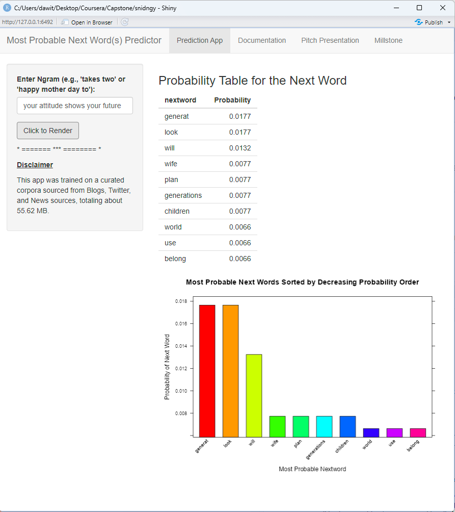

## Introduction
Most Probable Next Word(s) Predictor

**Objective:** Predicting the next word based on user-input ngrams (sequence of words). 

**Internal Structure:** The prediction uses a curated corpus from Blogs, Twitter, and News sources provided by the John Hopkins University Data Science instructors at Coursera. 
The Prediction Model was trained on a combined randomly selected 10% sample from each corpus, totaling approximately 55.62 MB. 

Accuracy was checked on unseen vector of testing data and found to be reasonable.

## Neurology

**Method:** Markov Model Approach

The model predicts the most probable next words for input sequences of words ranging from single words up to five-word combinations (n-grams). For n-grams longer than five words, it considers only the last five words for prediction. If prediction fails with a five-word context (n=5), it iteratively reduces the context length (n=4, 3, 2, 1) until a suitable prediction is found. If no prediction is successful even at the single-word context (n=1), it defaults to the most frequent words from its training data.

## Availablity:

**Deployment:**

- Will be deployed at ShinyApp.IO: [ShinyApp: Most Probable Next Word(s) Predictor](https://shiny.posit.co/)

- Github Project Page: [Most Probable Next Word(s) Predictor](https://github.com/dawit3000/snidngy)

**Visualization:**  See Documentation for more

  

## Use,  Future Directions

**Potential Use Cases:** 

- [Microsoft SwiftKey](https://www.microsoft.com/en-us/swiftkey) in mind.

- Other assistive typing applications.

- Automated text completion tools.

- Enhancing user experience in chatbots and natural language processing applications.

**Future Directions:**

- Enhancements in model accuracy.

- Expansion to larger datasets and additional text sources.

